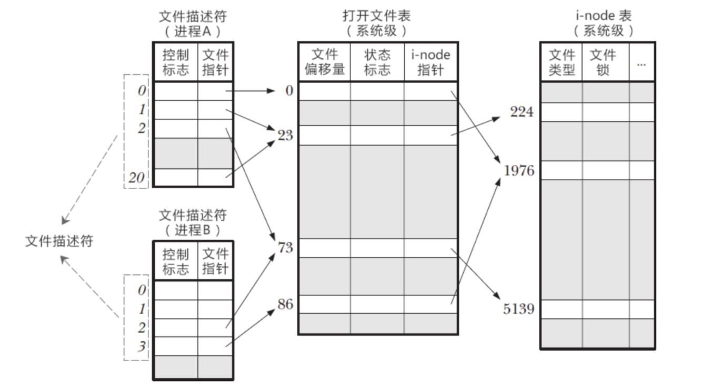
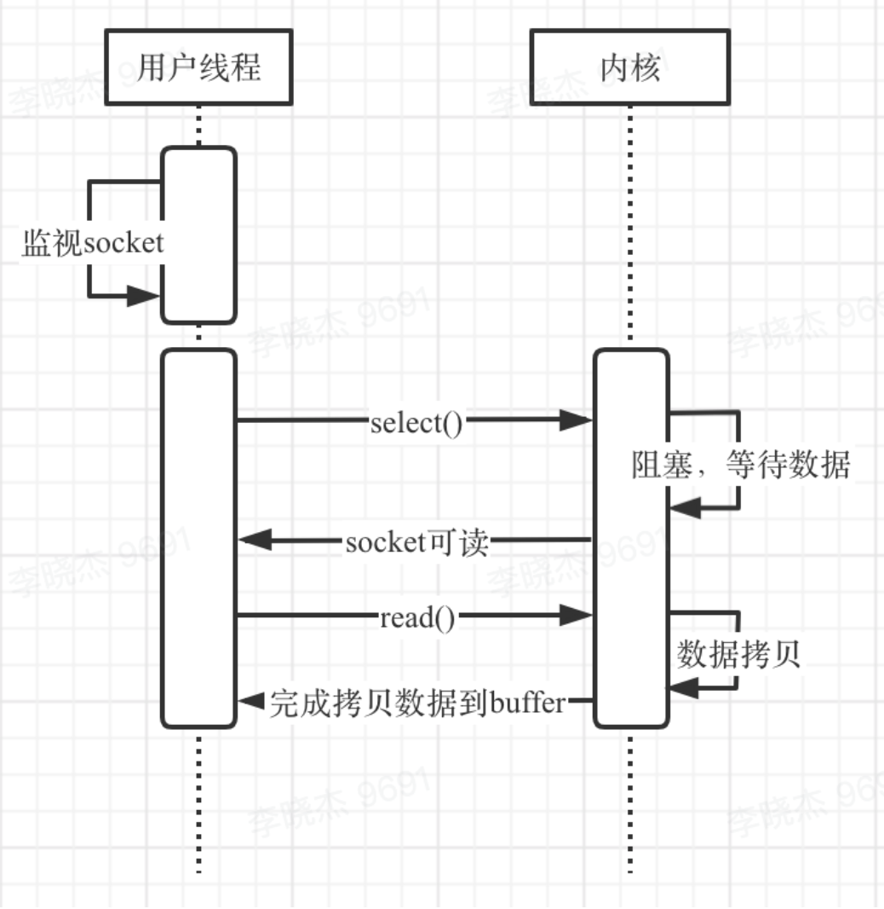
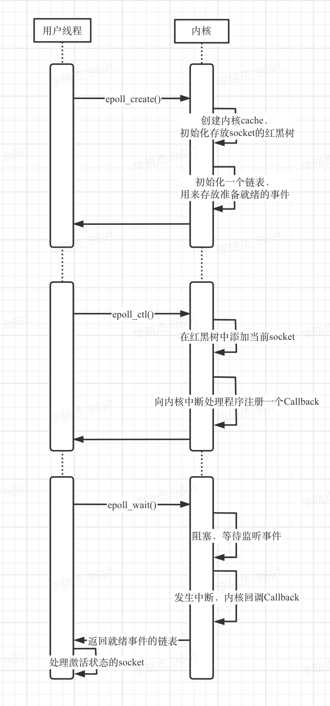

## 1.关于 fd(file description,文件描述符)



- Inode：记录了文件的元信息，包括文件的创建者、创建时间、文件大小、userid、groupID、RWX权限，链接数（多少个文件名指向这个inode）、文件数据block的位置...
- Block：文件存储在硬盘上，最小的存储单位是**扇区**，每个扇区512字节(0.5KB)，当操作系统读取硬盘的时候，如果从一个一个扇区里面读取，效率很低，所以会一次读取多个扇区，多个扇区组成了块(block)，常见是4KB
- 系统打开一个文件的流程：每个inode都有自己的inode号码，**系统内部使用inode来识别文件，而不是文件名**。实际上，每打开一个文件，流程是这样：系统找到这个文件名对应的inode号码，通过inode号码找到inode，通过inode信息，找到文件数据所在的block，然后读取数据。
- 每个进程启动后，会申请一段内存用来存放进程的文件描述符表，而文件描述符可以认为是这个文件描述符表的索引
- 系统为了维护文件描述符，建立了三个表：进程级别的文件描述表、系统级别的文件描述表（打开文件表）、inode表
  - 文件描述符：记录单个文件描述符的相关信息
  - 打开文件表：每一个条目称为打开文件句柄，描述了一个打开文件的全部信息
  - inode表：每个文件系统会为存储于其上的所有文件（目录）维护一个inode表
- 进行IO操作时的流程：当需要进行IO操作的时候，会先传入fd作为参数（文件描述符表的索引），进而通过文件指针找到打开文件表对应的记录，再通过inode指针找到该文件指向的inode，进而找到文件真正的位置，进行IO操作。

## 2.IO 多路复用

I/O多路复用是一种**同步IO模型**，实现**一个线程监视多个文件句柄**，当某个文件句柄就绪，就及时通知响应的进程进行IO操作，当**没有文件句柄就绪时，会阻塞当前应用，交出CPU**。这里多路复用，是指多个网络连接，复用同一个线程。

### 2.1 为什么要有 IO 多路复用

#### 2.1.1 同步阻塞 IO 模型

​		用简单的java socket示例来说，当服务端采用单线程时，每当accept()一个请求后，在handler()方法未完成之前，是无法处理第二个请求的，这时候**存在的问题是服务端无法并发处理。**

​		那么可以考虑采用多线程，当accept()一个请求后，创建一个新线程，异步调用handler()方法进行处理，这样可以完成请求的并发处理，但是随着请求数增加线程的数量也在增加，大量的线程会占用很大的内存资源，线程切换也会带来很大的开销（JVM 的内存模型中，内核线程与与 Java 线程是 1 对 1 的，因此频繁切换线程将会频繁从内核态切换到用户态，仍是一个巨大的开销），所以多线程也不是一种好的解决方案。

```java
public class Server {
  private static final int Port = 8888;
  private ServerSocket serverSocket;
  
  public static void main(String[] args){
    	Server server = new Server(PORT);
      server.start();
  } 
  
  public Server(int port) {
    	try{
        	this.serverSocket = new ServerSocket(port)
      }catch (IOException e){
        	System.out.println("server start error");
      }
  }
  
  public void start() {
    	new Thread(new Runnable(){
        	public void run(){
            	process();
          }
      }).start()
  }
  
  private void process() {
        try {
            while (true) {
              	/**
              	*	接收客户端连接并分配线程处理
              	*/
                Socket socket = serverSocket.accept();
                handler(socket);
            }
        } catch (IOException e) {
            e.printStackTrace();
        }
    }
  private void handler(Socket socket) throws IOException {
        InputStream inputStream = socket.getInputStream();
        ByteArrayOutputStream bos = new ByteArrayOutputStream();
        byte[] data = new byte[1024];
        int len;

        while(inputStream.available() != 0) {
            len = inputStream.read(data);
            bos.write(data, 0, len);
            socket.getOutputStream().write(data);
        }
        String result = bos.toString();
        System.out.println(result);

        bos.close();
        inputStream.close();
        socket.close();
    }
}
```

#### 2.1.2 同步非阻塞 IO

Linux 创建 socket 时，在默认的阻塞模式下，socket相关的recv()/send()会阻塞在那里，直到socket上有数据读到buffer里面才会返回

```c
int recv( SOCKET s, char FAR *buf, int len, int flags);
```

可以通过下面两行将当前socket设置成非阻塞的，此时即使socket中没有数据，recv()也不会阻塞，而是返回一个错误WSAEWOULDBLOCK，我们可以通过循环重复调用recv()直到读到数据(导致忙等待)，但是这样会有效率问题

```c
flags = fcntl(connetfd, F_GETFL, 0);
fcntl(connetfd, F_SETFL, flags | O_NONBLOCK);
```

### 2.2 IO多路复用

​		可以看出，同步阻塞I/O模型和同步非阻塞I/O模型的缺点都非常明显，而I/O多路复用模型可以**在一个线程内部完成对多个连接的管理**，在I/O多路复用模型下，只有当监听的文件描述符有事件发生时，遍历有事件的fd并进行accept()/recv()/send()，使进程能支持更多并发连接的请求。

常见的I/O多路复用有三种实现方式：select, poll和epoll（poll 和 select 比较相似）

## 3.select

### 3.1 select 时序



​		在用户线程，需要将进行I/O操作的socket添加到select中，select会阻塞等待，当有数据到达时，socket被激活，此时select会返回，用户线程对激活的socket发起read请求读取数据。

### 3.2 select详解

```c
/*select API*/
#include <sys/select.h>
#include <sys/time.h>
#include <sys/types.h>
#include <unistd.h>
int select(int maxfdp, fd_set *readset, fd_set *writeset, fd_set* exceptset,struct timeval *timeout);


/*select相关宏*/
#include <sys/select.h>   
int FD_ZERO(int fd, fd_set *fd_set);   //将一个fd_set类型变量的所有位都设为0
int FD_CLR(int fd, fd_set *fd_set);    //清除某个位时可以使用
int FD_SET(int fd, fd_set *fd_set);    //设置变量的某个位 置位
int FD_ISSET(int fd, fd_set *fd_set);  //测试某个位是否 被置位
```

#### 3.2.1 fd_set

[fd_set](https://baike.baidu.com/item/fd_set/6075513)

假设fd_set长1字节，每一位对应一个fd，1字节的fd_set最大可以对应8个fd。

#### 3.2.2 select

```c
fd_set fdset 				//初始化fd_set
int fd = 5
FD_ZERO(&fdset) 		//将fd_set所有位 置零 此时fd_set为00000000
FD_SET(fd, &fdset) 	//将第5位置1，记为00010000
FD_SET(1, &fdset) FD_SET(2, &fdset) //再加入1,2，记为00010011
select(6, &fdset, 0, 0, 0) //执行select，当前会阻塞在这里
/**
*	此时1，2 发生可读事件，select函数返回，此时fdset变为00000011
*	注意这里因为5没有发生可读事件，所以第5位为0
*/
FD_ISSET(1, &fdset) //判断第1位是否被置位
FD_CLR(5, &fdset) 	//将第5位从监听队列中删除
```

select模型的几个特点：

1. 可监控的文件数量为`sizeof(fd_set)`。
2. 初始化fd_set时为00010011，select()执行过后会将未发生事件的位置0，并需要将新的fd_set与原fd_set通过FD_ISSET判断出是否置位(这里会存在一个for循环)，当循环结束后，开启下一轮select()前，需要先调用FD_ZERO()将所有位设置为0，再从原fd_set将每一位拷贝到fd_set。

#### 3.2.3 使用案例

```c
server_socketfd = socket(AF_INET, SOCK_STREAM, 0); //初始化服务端socket
bind(server_socketfd, (struct socketaddr *)&server_address, server_len); //绑定socket到本地端口
listen(server_socket, 5) //监听端口
// ...
fd_set readfds; 		//初始化一个可读的fd_set
FD_ZERO(&readfds);	// 将其置为0
FD_SET(server_socketfd, &readfds); //将刚才声明的服务端socket添加到可读fd_set中

while(1) {
    testfds = readfds; //每次调用select前需要重新拷贝源fd_set
    result = select(FD_SETSIZE, &testfds, 0, 0, 0);	// 等待select返回活跃端口
    // ...
  	// 需要遍历所有的fd，找到对应位置为 1 的 fd
    for(fd = 0; fd < FD_SETSIZE; fd++) {
        if (FD_ISSET(fd, &testfds)) {
            if (fd == server_socketfd) {
                //服务端socket被置位，说明有来自客户端的请求
                // ...
                client_socketfd = accept(server_socketfd, &client_address, &client_len) //accept客户端连接请求
                FD_SET(client_socketfd, &readfds); //将建立的客户端连接socket加入到fd_set中;
               	// ...
                
            } else {
                // 根据从socket中取到的数据判断是来自客户端前的请求，还是可是客户端请求完毕，需要关闭当前fd
            }
        }
    }
}
```

#### 3.2.4 select 的缺点

- 单个进程能监听fd_set的大小是有限的（最大为 1024 个）。
- 每一轮循环对fd_set的扫描是线性的，O(N)的效率很低，无论当前fd是否活跃，都会被扫描到。
- 需要一个存放源fd_set的数据结构，并且这个**fd_set会在用户空间和内核空间复制**，也存在开销。

## 4. epoll 

### 4.1 epoll 时序



​		上面提到的select的缺点：select不管当前fd是否被激活，每一轮调用都需要遍历一遍所有的socket，当socket数量多时，由内核向用户空间拷贝fd_set的也会产生比较大的开销。而**epoll仅当监听的socket被激活时才会返回相应的socket**，不再去轮询一遍所有的socket，这相比起select性能有了很大提升。

​		再看epoll的时序图，首先需要调用epoll_create()初始化一个epoll对象，此时会从epoll的cache区为epoll对象分配内存(epoll作为一个内核模块，在内核启动时就为epoll分配了一块cache，**后续epoll相关的内存分配都会通过调用alloc()从cache中直接取，而不是调用malloc()重新分配**)，在内存中将会以**红黑树的形式存放未来需要监控的每一个socket**，支持快速的查找、插入和删除，**同时会初始化一个链表（准备就绪链表），存来存放将来被激活的socket**。

​		创建了epoll对象后，需要**调用epoll_ctl()将我们需要监听的每一个socket添加到epoll内对应的红黑树上，并向内核中断处理程序注册一个回调函数，当对应socket句柄的中断到了（socket上有数据了），通过回调函数将socket添加到上面的准备就绪链表**。

​		epoll之所以高效，就是在于当调用epoll_wait()时，仅仅去监控准备就绪链表中是否存在数据，而不是遍历全部被监控的socket，所以即使监控百万计的句柄，大多时候一次epoll_wait()返回的只是少部分准备就绪的句柄。

[epoll源码分析](https://icoty.github.io/2019/06/03/epoll-source/)

### 4.2 epoll API

```c
int epoll_create(int size);  //创建epoll对象
int epoll_ctl(int epfd, int op, int fd, struct epoll_event *event);  //将socket添加到epoll中被监听，或者将socket从epoll中移除
int epoll_wait(int epfd, struct epoll_event *events,int maxevents, int timeout); //类似select()，阻塞等待epoll监听的句柄有事件发生


typedef union epoll_data 
{
    void *ptr;
    int fd;
    __uint32_t u32;
    __uint64_t u64;
} epoll_data_t;
 
struct epoll_event {
    __uint32_t events;      /* Epoll events */
    epoll_data_t data;      /* User data variable */
}; 
```

### 4.3 使用案例

```c
/*使用epoll的ET模式，需要将socket设置为非阻塞模式
- 水平触发（LT）：默认工作模式，即当epoll_wait检测到某描述符事件就绪并通知应用程序时，应用程序可以不立即处理该事件；下次调用epoll_wait时，会再次通知此事
- 边缘触发（ET）： 当epoll_wait检测到某描述符事件就绪并通知应用程序时，应用程序必须立即处理该事件。如果不处理，下次调用epoll_wait时，不会再次通知此事件。
*/
void setnonblocking(int sock)
{
    int opts;
    opts = fcntl(sock, F_GETFL);
    if(opts < 0)
    {
        perror("fcntl(sock,GETFL)");
        exit(1);
    }
    opts = opts | O_NONBLOCK;
    if(fcntl(sock, F_SETFL, opts) < 0)
    {
        perror("fcntl(sock,SETFL,opts)");
        exit(1);
    }
}

int main() {
    // ......
    //生成用于处理accept的epoll专用的文件描述符
    epfd = epoll_create(256);
    struct sockaddr_in clientaddr;
    struct sockaddr_in serveraddr;
    listenfd = socket(AF_INET, SOCK_STREAM, 0);
    //把socket设置为非阻塞方式
    setnonblocking(listenfd);
    //设置与要处理的事件相关的文件描述符
  	struct epoll_event ev;
    ev.data.fd = listenfd;
    //设置要处理的事件类型，当描述符可读时出发，触发方式为ET模式
    ev.events = EPOLLIN | EPOLLET;
    //注册epoll事件
    epoll_ctl(epfd, EPOLL_CTL_ADD, listenfd, &ev);
    // ......
    bind(listenfd, (sockaddr *)&serveraddr, sizeof(serveraddr));
    //开始监听
    listen(listenfd, LISTENQ);
    for (;;) {
        //等待epoll事件的发生
        nfds = epoll_wait(epfd, events, 20, 500);
        //处理所发生的所有事件
        for(i = 0; i < nfds; ++i) {
            if(events[i].data.fd == listenfd) {
                //当就绪的fd为server监听的fd时，表示收到来自客户端请求建立连接
                //accept()与客户端建立连接，并得到一个当前socket对应的fd
                connfd = accept(listenfd, (sockaddr *)&clientaddr, &clilen);
                if(connfd < 0)
                {
                    perror("connfd<0");
                    exit(1);
                }
                //把新的socket fd设置为非阻塞模式
                setnonblocking(connfd);
                ev.data.fd = connfd;
                //设置用于注册的读操作事件，并使用epoll的ET模式
                ev.events = EPOLLIN | EPOLLET;
                //注册ev
                epoll_ctl(epfd, EPOLL_CTL_ADD, connfd, &ev);
            } else if(events[i].events & EPOLLIN) {
                // 当前监听的socket有数据可以读，可以执行读数据逻辑
                ......
            } else if(events[i].events & EPOLLOUT) {
                // 表示当前监听的fd可以进行数据写入，需要server写入向客户端返回的数据
                ...
            }
        }
    }
}
```

## 5. epoll 在 Redis 中的应用

redis相关的面试题都会有这样几个问题：

> 1. 简单说一下redis的单线程模型
> 2. 为什么redis使用单线程却有非常高效的性能

​		回顾上面关于epoll的讨论，讲到epoll是I/O多路复用模型的一种实现，而多路复用的核心就是多个网络连接复用一个线程。**redis的默认的网络模型是基于epoll实现的**，这解答了第一个问题，因为epoll是一个单线程模型。

​		redis的高效也可以用epoll的高效来解释，**即使建立了数以万计的连接，但是同一时刻处于就绪状态的往往并不是很多，epoll_wait()内部仅通过监听一个就绪链表来决定函数是否返回，而不像select()那样轮询监听的每一个连接**（但是redis也可以选择使用select()的方式运行），下面通过部分redis的源码来看看redis是如何使用epoll的。

> ```shell
> 源码地址
> wget http://download.redis.io/releases/redis-6.0.7.tar.gz
> tar -zxvf redis-6.0.7.tar.gz
> cd redis-6.0.7/src
> ```

1. 先看redis服务初始化的地方server.c，initServer()内部通过调用aeCreateEventLoop()函数来创建epoll对象

   ```c
   void initServer(void) {
       // ......
     	// 创建 epoll 对象，设置最大连接数
       server.el = aeCreateEventLoop(server.maxclients+CONFIG_FDSET_INCR);
       if (server.el == NULL) {
           serverLog(LL_WARNING,
               "Failed creating the event loop. Error message: '%s'",
               strerror(errno));
           exit(1);
       }
       // ......
   }
   ```

   

2. 进到aeCreateEventLoop()方法内部，redis定义了aeEventLoop结构体来保存待处理**文件事件**和**时间事件**，和大量事件执行的上下文信息，aeEventLoop可以参考下这篇文章[Redis中的事件循环](https://draveness.me/redis-eventloop/)，这里需要关注的是`void *apidata`，它被用来存放polling API 相关的数据(刚才说到redis支持epoll/select/evport/kqueue这几种polling API)，下面这张图可以看出aeApiCreate()在不同polling API下有不同的实现，下面我们就进入epoll的aeApiCreate()看看。

   ```c
   /* State of an event based program */
   typedef struct aeEventLoop {
       int maxfd;   /* highest file descriptor currently registered */
       int setsize; /* max number of file descriptors tracked */
       long long timeEventNextId;
       time_t lastTime;     /* Used to detect system clock skew */
       aeFileEvent *events; /* Registered events */
       aeFiredEvent *fired; /* Fired events */
       aeTimeEvent *timeEventHead;
       int stop;
       void *apidata; /* This is used for polling API specific data */
       aeBeforeSleepProc *beforesleep;
       aeBeforeSleepProc *aftersleep;
       int flags;
   } aeEventLoop;
   
   
   aeEventLoop *aeCreateEventLoop(int setsize) {
       aeEventLoop *eventLoop;
       int i;
       ......
       if (aeApiCreate(eventLoop) == -1) goto err;
       ......
   err:
       if (eventLoop) {
           zfree(eventLoop->events);
           zfree(eventLoop->fired);
           zfree(eventLoop);
       }
       return NULL;
   }
   ```

3. 来到ae_epoll.c的aeApiCreate()方法内部，redis定义了aeApiState结构体，用来保存初始化epoll时得到的文件描述符和epoll_event。aeApiCreate()方法初始化了epoll_event，并调用epoll_create()创建了epoll对象，将得到的epoll文件描述符保存到aeApiState.epfd中。

   ```c
   typedef struct aeApiState {
       int epfd;
       struct epoll_event *events;
   } aeApiState;
   
   
   static int aeApiCreate(aeEventLoop *eventLoop) {
       aeApiState *state = zmalloc(sizeof(aeApiState));
   
       if (!state) return -1;
       state->events = zmalloc(sizeof(struct epoll_event)*eventLoop->setsize);
       if (!state->events) {
           zfree(state);
           return -1;
       }
       state->epfd = epoll_create(1024); /* 1024 is just a hint for the kernel */
       if (state->epfd == -1) {
           zfree(state->events);
           zfree(state);
           return -1;
       }
       eventLoop->apidata = state;
       return 0;
   }
   ```

4. 回到initServer()，完成epoll_create()后，redis server开始监听对应的端口，这里通过anetNonBlock(NULL,server.sofd)将socket设置为非阻塞模式。

   ```c
   void initServer(void) {
   /*创建epoll*/
       ......
   /* Open the TCP listening socket for the user commands. */
       if (server.port != 0 &&
           listenToPort(server.port,server.ipfd,&server.ipfd_count) == C_ERR)
           exit(1);
       if (server.tls_port != 0 &&
           listenToPort(server.tls_port,server.tlsfd,&server.tlsfd_count) == C_ERR)
           exit(1);
   
   
   /* Open the listening Unix domain socket. */
       if (server.unixsocket != NULL) {
           unlink(server.unixsocket); /* don't care if this fails */
           server.sofd = anetUnixServer(server.neterr,server.unixsocket,
               server.unixsocketperm, server.tcp_backlog);
           if (server.sofd == ANET_ERR) {
               serverLog(LL_WARNING, "Opening Unix socket: %s", server.neterr);
               exit(1);
           }
           anetNonBlock(NULL,server.sofd);
       }
   }
   ```

5. 在initServer()的最后，通过aeCreateFileEvent()和aeCreateTimeEvent()函数将fd与相对应的事件通过epoll_ctl()添加到红黑树中，并创建一个就绪链表，aeApiAddEvent()就是redis对epoll_ctl()的封装

   ```c
   static int aeApiAddEvent(aeEventLoop *eventLoop, int fd, int mask) {
       aeApiState *state = eventLoop->apidata;
       struct epoll_event ee = {0}; /* avoid valgrind warning */
       /* If the fd was already monitored for some event, we need a MOD
        * operation. Otherwise we need an ADD operation. */
       int op = eventLoop->events[fd].mask == AE_NONE ?
               EPOLL_CTL_ADD : EPOLL_CTL_MOD;
   
   
       ee.events = 0;
       mask |= eventLoop->events[fd].mask; /* Merge old events */
       if (mask & AE_READABLE) ee.events |= EPOLLIN;
       if (mask & AE_WRITABLE) ee.events |= EPOLLOUT;
       ee.data.fd = fd;
       if (epoll_ctl(state->epfd,op,fd,&ee) == -1) return -1;
       return 0;
   }
   ```

6. 回到main()函数，initServer()执行完成后，最后会执行asMain()函数，asMain()内部启动一个while循环执行aeProcessEvent()，aeProcessEvent()内部会调用aeApiPoll()，aeApiPoll()就是redis对epoll_wait()的封装。

   ```c
   int main(int argc, char **argv) {
       ......
       initServer()
       ......
       aeMain(server.el);
       aeDeleteEventLoop(server.el);
   }
   
   
   void aeMain(aeEventLoop *eventLoop) {
       eventLoop->stop = 0;
       while (!eventLoop->stop) {
           aeProcessEvents(eventLoop, AE_ALL_EVENTS|
                                      AE_CALL_BEFORE_SLEEP|
                                      AE_CALL_AFTER_SLEEP);
       }
   }
   ```

7. 最后来到aeApiPoll()，在这里会调用epoll_wait()，线程会阻塞在这里直到有监听的socket被激活，epoll_wait()仅会返回当前有事件发生的就绪链表

   ```c
   static int aeApiPoll(aeEventLoop *eventLoop, struct timeval *tvp) {
       aeApiState *state = eventLoop->apidata;
       int retval, numevents = 0;
   
   
       retval = epoll_wait(state->epfd,state->events,eventLoop->setsize,
               tvp ? (tvp->tv_sec*1000 + tvp->tv_usec/1000) : -1);
       if (retval > 0) {
           int j;
   
   
           numevents = retval;
           for (j = 0; j < numevents; j++) {
               int mask = 0;
               struct epoll_event *e = state->events+j;
   
   
               if (e->events & EPOLLIN) mask |= AE_READABLE;
               if (e->events & EPOLLOUT) mask |= AE_WRITABLE;
               if (e->events & EPOLLERR) mask |= AE_WRITABLE|AE_READABLE;
               if (e->events & EPOLLHUP) mask |= AE_WRITABLE|AE_READABLE;
               eventLoop->fired[j].fd = e->data.fd;
               eventLoop->fired[j].mask = mask;
           }
       }
       return numevents;
   }
   ```

   ​		至此看完了epoll API在redis源码中的使用，redis整个**main()函数中没有对线程的切换，epoll_wait()返回后的操作也是串行的，在一个请求没完成前是无法执行另一个请求的**，这么看redis其实很容易出现延迟的问题，但是**redis本身都是基于内存的操作，所以即使是串行执行命令的也不会有太大的延迟问题，另外这种单线程的模型也避免了其他可能出现的复杂的并发问题**。

